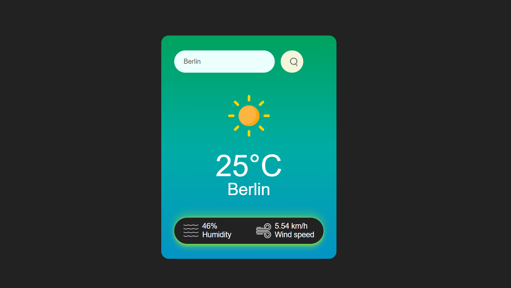

# 🌦️ Weather App

## 🧩 About
The **Weather App** is a simple and interactive web application that allows users to check real-time weather information of any city around the world.  
It uses the **OpenWeatherMap API** to fetch live data and displays temperature, humidity, weather condition, and wind speed in a clean and responsive design.

---

## ✨ Features
- 🌍 Search weather by city name  
- 🌡️ Displays temperature, humidity, and wind speed  
- ☁️ Shows weather condition icons dynamically  
- 📱 Responsive and user-friendly UI   

---

## 🛠️ Tech Stack
- **HTML5** – structure of the app  
- **CSS3** – for styling and responsiveness  
- **JavaScript (ES6)** – for API integration and interactivity  
- **Weather API:** [OpenWeatherMap](https://openweathermap.org/api)

---

## 📸 Screenshots



---

## 🚀 How to Run Locally

### 1️⃣ Clone the repository
```bash
git clone https://github.com/yourusername/weather-app.git
```

### 2️⃣ Navigate into the project folder
```bash
cd weather-app
```

### 3️⃣ Open the app
Simply open the index.html file in your browser.

### ⚙️ API Setup 

If you want to use your own API key:
1. Go to OpenWeatherMap
2. Sign up and generate your free API key
3. Replace the sample key in your JavaScript file with your key:
```bash
const apiKey = "YOUR_API_KEY";
```
### 🧑 Author
Rehan Patham
🔗 https://github.com/rehanpathan0801
